# dungreed Portfolio
## main화면

## 메인화면 버튼들
### 버튼에 마우스를 올리면 색과 크기 변하는 효과

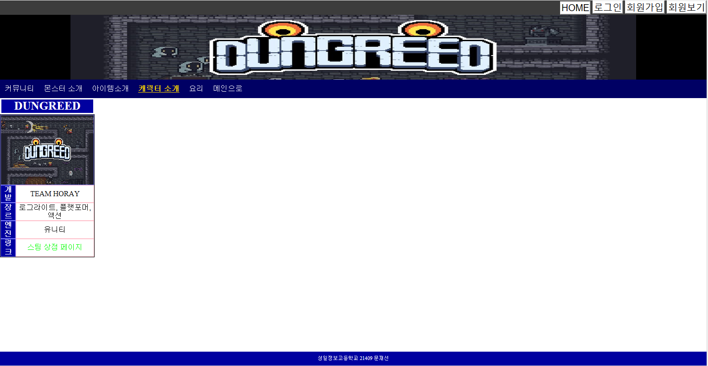
## 메인화면 세션 테이블 이미지
### 이미지에 마우스를 올리면 다른 이미지로 변경
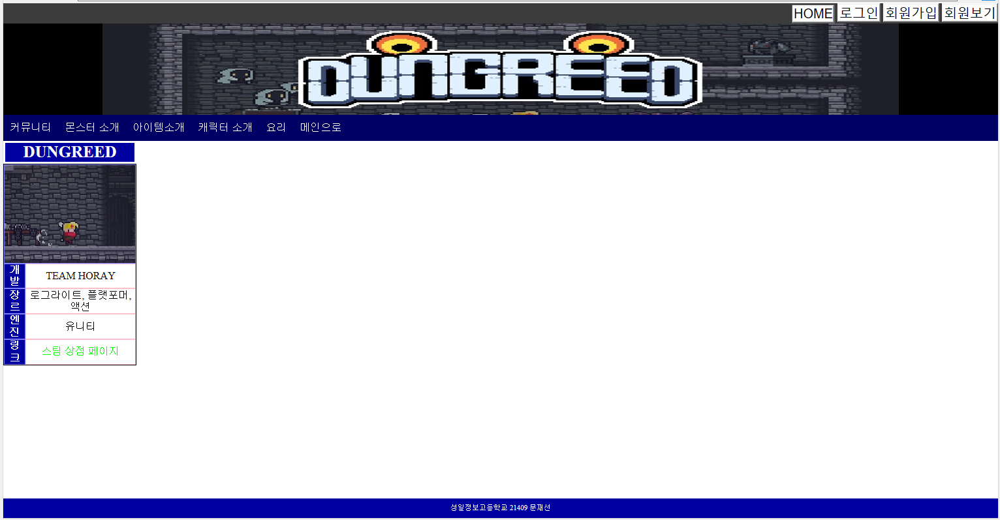
## 메인화면 세션 테이블 링크
### 링크를 클릭하면 게임 구매 사이트로 이동합니다.
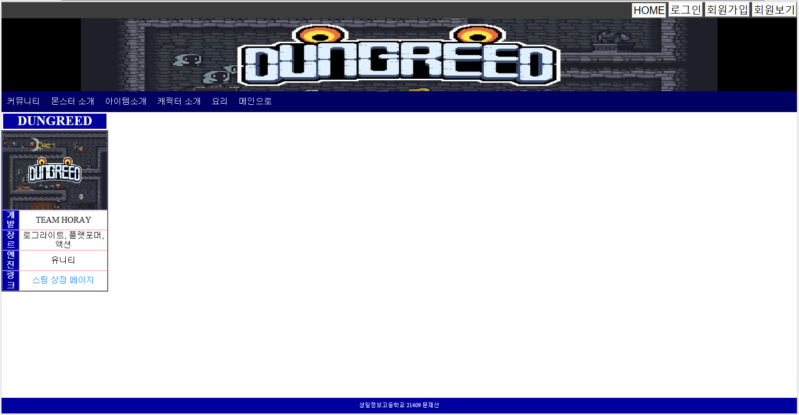
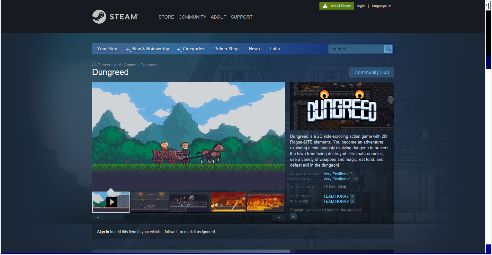
## 회원가입
### 회원가입 창으로 이동하여
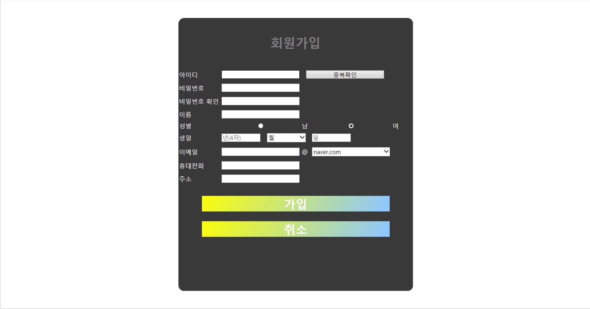
### 정보를 입력하고
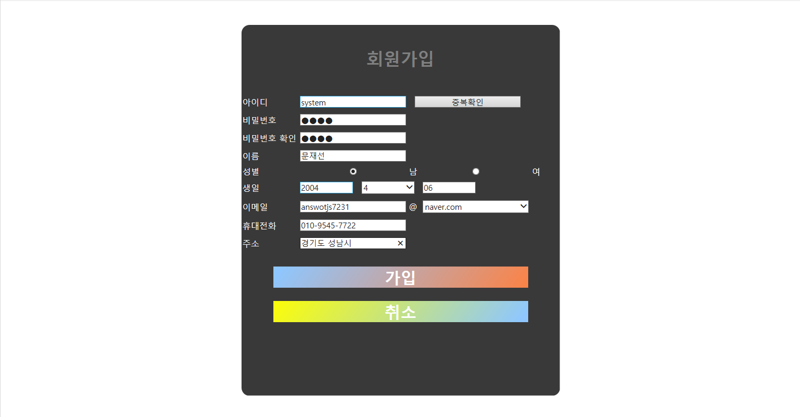
### 가입 버튼을 누르면
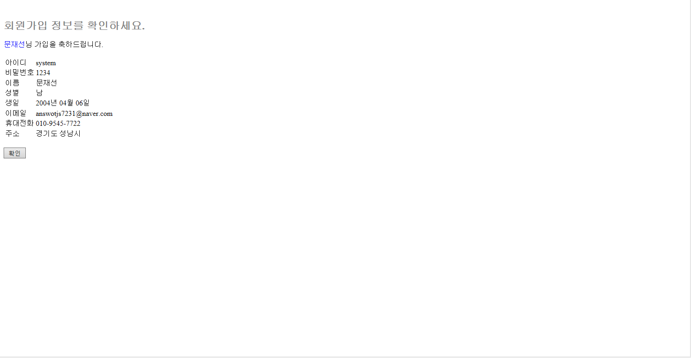
### 회원가입이 됩니다
## 데이터베이스
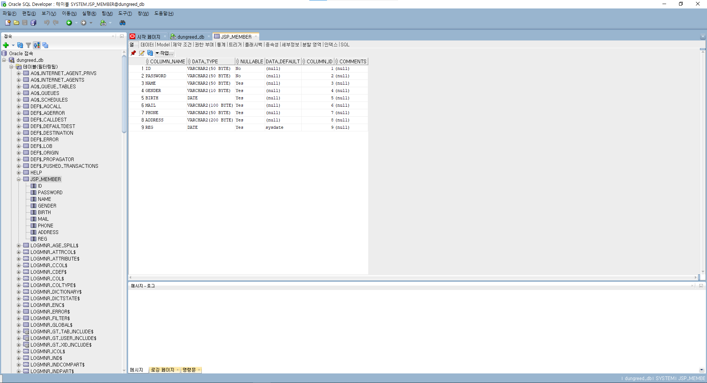
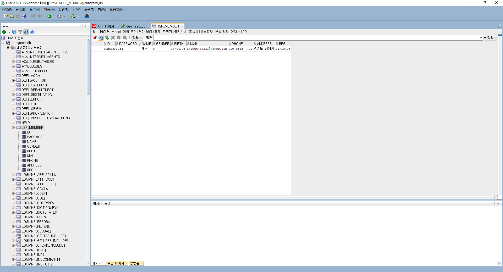
### 데이터베이스에도 데이터가 잘 삽입된 것을 볼 수 있습니다.
### 확인을 누르면
## 로그인
### 로그인 창으로 이동합니다.
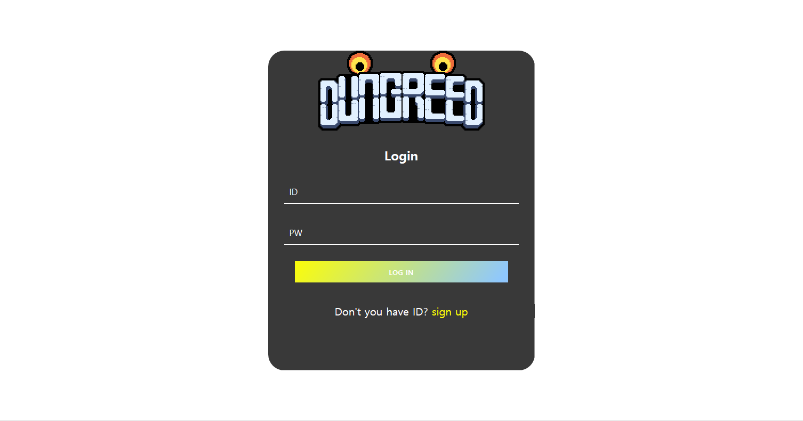
### 정보를 입력하고

### 로그인을 누르면 메인화면으로 넘어가며 로그아웃버튼과 내정보버튼이 생깁니다.
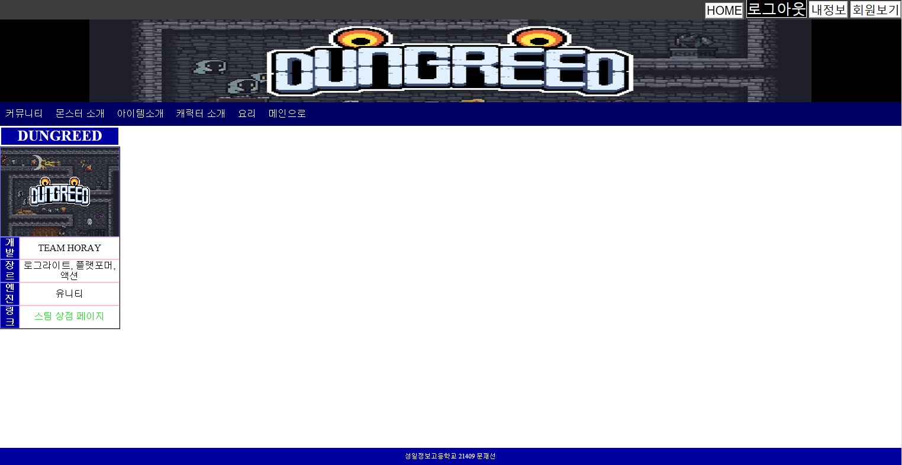
### 로그아웃을 하면 원래의 메인화면으로 돌아옵니다.

